# Analysis of Machine Learning on Scene Recognition
<strong>Ryan Ding, Ema Goh, Rachna Sahasrabudhe, George Ye</strong>
# Introduction
## Motivation
Image recognition is a powerful component of machine learning, with many applications such as creating camera autofocus settings (Corrado, 2020), robotics (Liu & Siegwart, 2013), and location tagging (Matthews et. al, 2010). All of these require image classifiers for many different settings. Our project aims to create an effective classifier for the following 5 outdoor scenes:
- Waterfalls
- Deserts
- Underwater
- Skyscrapers/Cities
- Rainforest
## Dataset
The dataset we used was the MIT Places Dataset. 

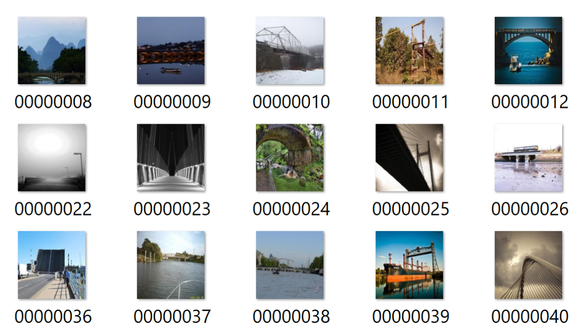

One of the simplest supervised learning algorithms that can be applied to image classification is K Nearest Neighbors, or KNN. In KNN, the images are compared using their distances to each other. To classify an image, it is compared to the k closest images, and classified as the class of the majority. 

Random Forest is another algorithm that can be applied to image classification. An extension of decision trees, Random Forest creates ensembles of decision trees that each use random subsets of the data in computing node splits. Given that the algorithm combines inputs from several different components, it tends to be more generalized and more accurate than a traditional decision tree. Consequently, Random Forest also tends to have comparatively reduced variances and less overfitting.

However, the current standard for more advanced and accurate image recognition models is using Convolutional Neural Networks (CNNs). In neural networks, features are extracted from the training set of images to create a feature map, by sliding kernels, or filters over the images. These kernels identify certain features within the image, such as curves or edges. Then, layers are applied to increase non-linearity and spatial variance. 

In our project, we implemented and compared the following models:
- KNN using Keras and Tensorflow
- Random Forest using the scikit learn and Orange 3 libraries
- CNNs using Keras and Tensorflow
   - We created the CNN by initially creating a neural network, and then adding convolutional layers. We have included results from the neural network to highlight the      contrast between it and the CNN. 

# Preprocessing

Each image in the MIT data set is 256x256 pixels. During the preprocessing stage, we resize the images to 28x28. Because color is an important feature in image classification of colored images, we divided each image into RGB channels.

The different algorithms we used required data to be passed in different ways, so we applied different methods of preprocessing for each. 
- KNN takes in points, so the images were flattened, and passed into the algorithm as vectors. 
- We decided to take a different, perhaps more interesting approach to preprocessing the data for Random Forest. Instead of flattening the images, we used a SqueezeNet network to create feature vectors from our dataset with the Orange3 GUI utility. The following graphic illustrates the feature extraction process. We were able to get 999 features per picture.

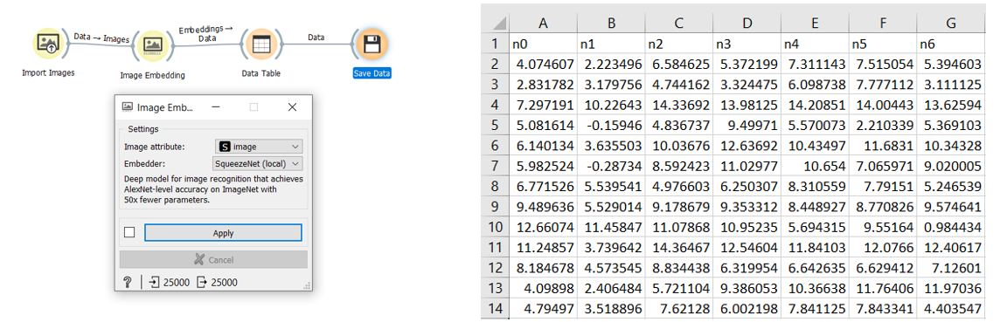
- The first layers of the neural network  and CNN included the preprocessing of the data. For the neural network, the images were flattened to be passed in as 1 dimensional inputs using a flattening layer. For the convolutional neural network, which is designed for 2D and 3D or color images, the images were simply resized. 

# Methods 

## 1. KNN
When we used a k value of 5, the model classified the images with an accuracy of 0.4513. When we increased the k value to 14, the accuracy increased slightly to 0.4653. While the accuracy isn’t that high, it is considerably better than chance which we thought was quite decent for a very simple model that we applied on complex data. 

### Finding number of Ks: Elbow Method
We used the elbow method to determine the best k value to use for the KNN method. We ran the model on k values from 1 to 20 and observed where the error rate started to flatten out. The optimal k value was 14 as seen on the graph below. 

### Confusion Matrix
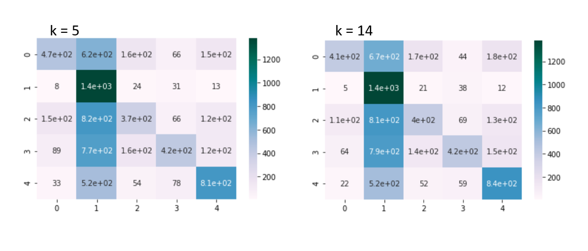

## 2. Neural Network to Convolutional Neural Network
We first implemented an neural network with a single hidden layer (dense, fully connected) and fed the model the vectorized images. Initially, we did not use a method of regularization and we ended up with an overfitted model. Here were the results of the loss values between the validation set and the testing set:
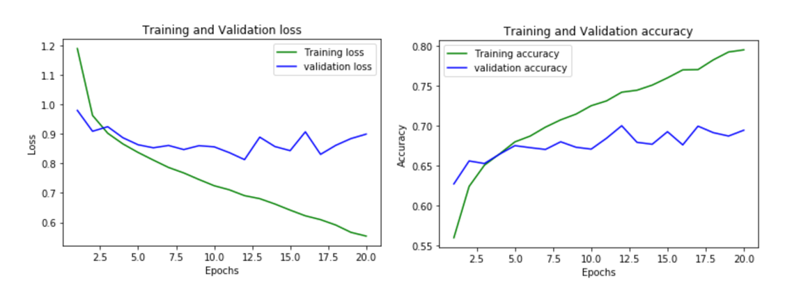

After realizing the issue with overfitting, we added a dropout layer, where some of the nodes in a layer are ignored. This fixed much of the overfitting problem and here were the results of the loss and accuracy values between the validation set and the testing set.
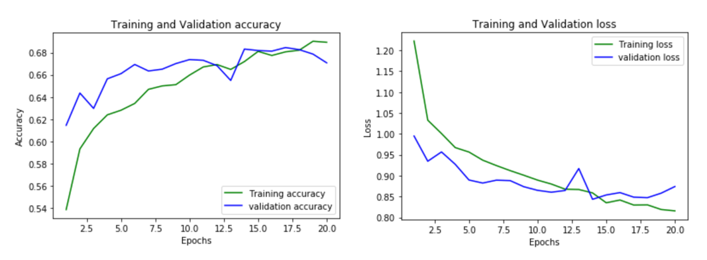

The neural network had a test accuracy of 67.08% and below is the confusion matrix:
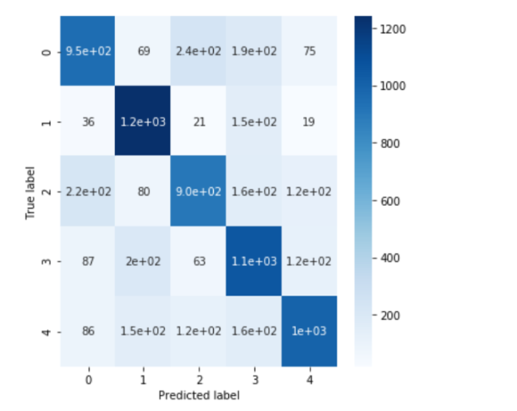

So it seems that the neural network performed better than the KNN algorithm, but can we do even better?

Yes! We can add convolutional layers and change our model to a CNN, which will produce much better results.

By adding two convolutional layers to the matrix, we produce these results:

82%
### CNN Loss and Accuracy:

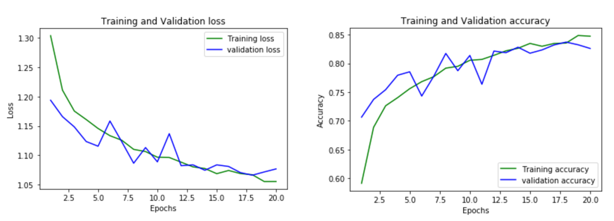

We were able to obtain an accuracy of 82%. Below is the confusion matrix for the CNN.

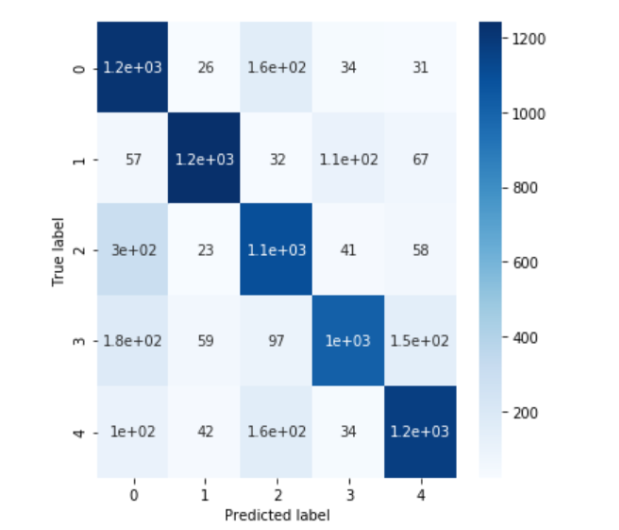

We can see that CNN performed better than the regular neural network. Here are some instances where the CNN was smarter than the regular neural network:

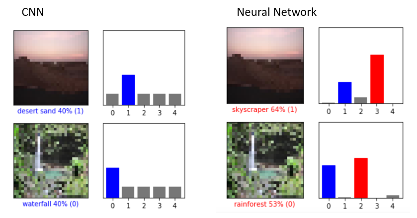

Comparing the same two images for both models, we can see the improvement in accuracy when switching from a Neural Network to a CNN. The Neural Network incorrectly classified the desert and waterfall image due to other categories (skyscraper and rainforest) having similar features. However, the CNN was able to distinguish the differences and categorize the images correctly.

## 3. Random Forest 
The Random Forest Classifier with relatively standard parameters (n_estimators = 10, max_depth = 5, criterion = “gini”) produced the following results. 

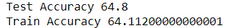

We decided to examine how such results would respond to optimizations of the number of trees, the max_depth, criterion and PCA. 
The following 4 graphs show the accuracy with respect to Number of Trees (n_estimators), max_depth, criterion, and number of principal components, respectively. 

From the graphs, we concluded that the following values would optimize the random forest algorithm:  
- Number of Trees (n_estimators) = 11, with diminishing returns promptly kicking in. This produces a training accuracy of around 80% and a testing accuracy around 99%. 
- The testing data accuracy appeared to stabilize at around max_depth = 12.
- We also fixed n_estimators = 3 and examined how the two different criterions affected testing data accuracy as the max_depth increased.  It would appear that the impact of the selected criterion is relatively minimal. The testing data accuracy became relatively steady as max_depth surpassed the value of 9, regardless of which criterion was used. 
- It would appear that the accuracy stays consistent as the number of principal components reaches 10 (fixing n_estimators = 11, max_depth = 12, criterion = “entropy”). 

We then ran the Random Forest Classifier using the optimized parameters n_estimators = 11, max_depth = 12, and criterion = “entropy” with PCA which produced the following results:

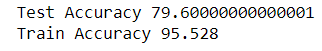

The accuracy of the Random Forest Classifier is quite notable, potentially as a result of the SqueezeNet preprocessing and the optimization of each parameter. However, the result may have been slightly generalized since the testing accuracy lagged a little behind the training accuracy. 

# Conclusion and Comparison of Models 
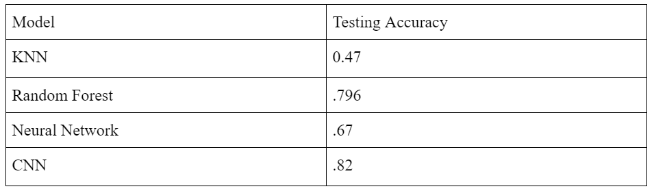

We were able to implement 4 different supervised algorithms for image classification, ranging from simple to the general standard for image recognition. 

KNN was better at recognizing the images than pure chance (20% since there are 5 classes), which is not remarkable but quite solid for a very naive algorithm, seeing as it just took the pixels as points and calculated which images were closest to each other. The colors in the image play a big role in this calculation, and therefore in the error. 

The Random Forest Algorithm classified the training data quite well, but became slightly overfit. Random Forest takes care of most overfitting since it is ensemble learning, but the model could have potentially been pruned more. It was also interesting that the seemingly optimal values for both n_estimators and max_depth produced notable improvements in overall accuracy. When combined, however, there is not necessarily a significant change (as test accuracy maxed out near 80 in all 3 instances). 

CNN captured the nonlinearity in the data the best. Thanks to the use of many filters and the two convolutional layers, CNN outperformed all of the other algorithms, demonstrating why it is used as the standard algorithm for most image classifiers. 
Overall error in the datasets could be a result of the dataset not being large enough; we used only 17,500 images out of 2,448,873 in the full MIT Places dataset. Another source of error is that some images in our classes could have belonged to multiple categories, such as images that overlapped between “waterfall” and “rainforest.” 
Our algorithms proved to be quite accurate, and these results are applicable to many fields, including mobile robot scene detection, image tagging security measures such as CAPTCHA, and autofocus algorithms used with camera equipment for better filmmaking, just to name a few. 

# Work Cited

Corrado, M. (2020). Scene Recognition System and Advanced Scene Recognition System from 
Nikon. Retrieved July 14, 2020, from 
https://www.nikonusa.com/en/learn-and-explore/a/products-and-innovation/scene-recognition-system-and-advanced-srs.html

Hao, W., Bie, R., Guo, J., Meng, X., & Wang, S. (2018). Optimized CNN Based Image 
Recognition Through Target Region Selection. Optik, 156, 772-777.

Liu, M., & Siegwart, R. (2013). Topological mapping and scene recognition with lightweight color descriptors for an omnidirectional camera. IEEE Transactions on Robotics, 30(2), 310-324. https://www.ram-lab.com/papers/2014/tromingliu2014.pdf

Matthews, P., Mantel, A., & Zou, C. C. (2010, April). Scene tagging: image-based CAPTCHA 
using image composition and object relationships. In Proceedings of the 5th ACM 
Symposium on Information, Computer and Communications Security (pp. 345-350).

Massachusetts Institute of Technology. (n.d.). MIT Places Database For Scene Recognition. 
Retrieved June 15, 2020, from http://places.csail.mit.edu/browser.html

[Back](/)

